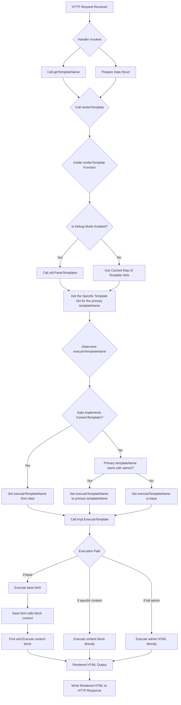

# Template Rendering Flowchart

```mermaid
graph TD
    A[HTTP Request Received] --> B{Handler Invoked}

    B --> C[Call getTemplateName]
    B --> D[Prepare Data Struct]

    C & D --> E{Call renderTemplate}

    E --> F{Inside renderTemplate Function}

    F --> G{Is Debug Mode Enabled?}
    G -- Yes --> H[Call util.ParseTemplates]
    G -- No --> I[Use Cached Map of Template Sets]

    H & I --> J[Get the Specific Template Set for the primary templateName]

    J --> K{Determine executeTemplateName}
    K --> L{Data implements ContentTemplater?}
    L -- Yes --> M[Set executeTemplateName from data]
    L -- No --> N[Primary templateName starts with admin/?]
    N -- Yes --> O[Set executeTemplateName to primary templateName]
    N -- No --> P[Set executeTemplateName to base]

    M --> Q[Call tmpl.ExecuteTemplate]
    O --> Q
    P --> Q

    Q --> R{Execution Path}

    R -- If base --> S[Execute base.html]
    S --> T[base.html calls block content]
    T --> U[Find and Execute content block]

    R -- If specific content --> V[Execute content block directly]

    R -- If full admin --> W[Execute admin HTML directly]

    U & V & W --> X[Rendered HTML Output]
    X --> Y[Write Rendered HTML to HTTP Response]
```
